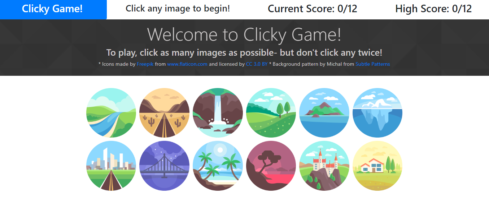

# Clicky Game!
A fun little React game!

### Developed by: Sarah Kinneer
#### April, 2019

## Technologies Used:
React, JavaScript, JSX, Bootstrap

## Note:
I chose to use a very basic Bootstrap layout for this app as I was more concerned with functionality than beautification for this particular app.

### The Game Layout

## Check Out the Live Site:
- [Link to Live Site](https://kinneers.github.io/clicky-game/)

## To Use:
1. Head to the live site at https://kinneers.github.io/clicky-game/.
2. Earn points by clicking on images without clicking on any image twice.
3. To begin the game, just click on any image.
4. Each time you successfully click an image for the first time, your current score will update and the images will shuffle on the page.
5. If you click an image twice, your current score will be reset.
6. Your highest score out of all the rounds you play will be saved in the current session.

This project was bootstrapped with [Create React App](https://github.com/facebook/create-react-app).
